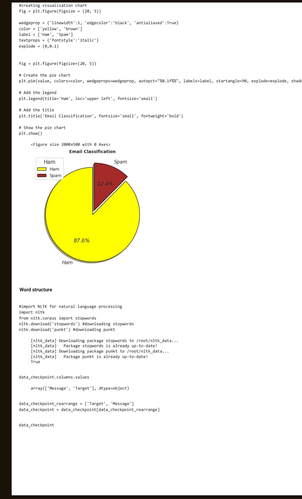
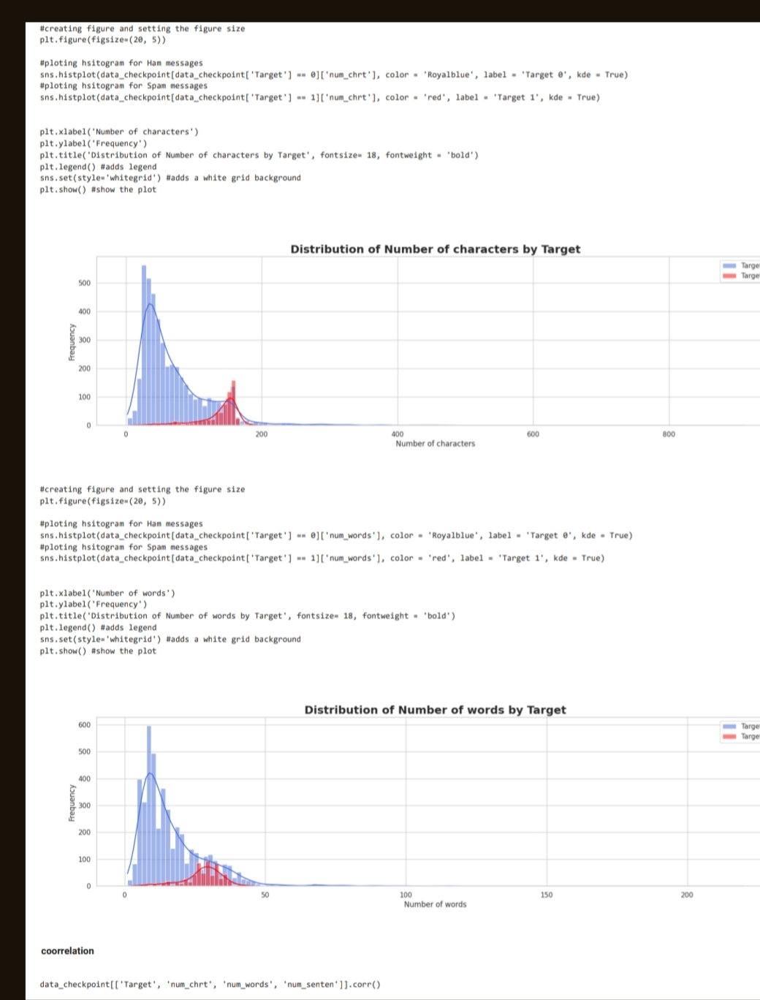
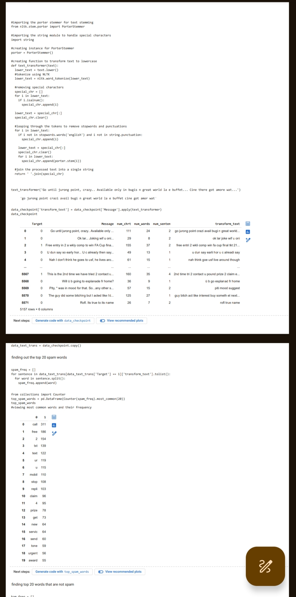

# SPAM MESSAGES DETECTOR- 
### Project Description 
The "Spam Message Detector" project aims to build a machine learning model
using logistic regression to classify messages as either spam or ham (non-spam). 
Leveraging libraries such as pandas, numpy, matplotlib, seaborn, NLTK, and sklearn, 
the project demonstrates proficiency in data processing, visualization, statistics, 
critical thinking, and problem-solving.

Utilizing a dataset containing labeled messages, the project preprocesses the data, 
explores its distribution through charts generated using matplotlib and seaborn, 
and conducts statistical analysis to gain insights. The data is then transformed 
and prepared for training the logistic regression model.
The logistic regression model is trained using sklearn, optimizing hyperparameters 
to achieve optimal performance. After training, the model is evaluated using metrics 
such as accuracy, precision, recall, and F1-score to assess its effectiveness in classifying 
spam and ham messages.. 
### Skills Utilized 
Machine Learning 
Jupyter Notebook 
Python 
Logistic Regression 
sk-learn 
Natural Language Processing  
Matplotlib 
Seaborn 
Data Visualization 
Data Cleaning 
Data Preprocessing 
Predictive Analysis 
Problem Solving 
Critical Thinking 
### Key Features 
Utilizes logistic regression to predict spam or ham messages. 
Includes comprehensive data cleaning and preprocessing steps. 
Demonstrates proficiency in data visualization using Matplotlib and Seaborn. 
Showcases critical thinking and problem-solving skills in building the machine learning model. 
Incorporates natural language processing techniques for text classification. 
. 
### Project Images 
#### Charts

#### Code snippet 

#### feature importance 

#### result obtained 

### Dataset Used 
The project uses WA_Fn-UseC_-Telco-Customer-Churn.csv for analysis. The dataset contains customer data such as CustomerID, Gender, Senior citizen, partner, dependent, tenure, phone service, Multiplelines, internet service, online security, online backup, Device protection, Tech support, streaming Tv, streaminovies, contract, paperless, payment method, monthly charges, total charges, churn. 
### Result Obtained 
After training the model, the project achieved an accuracy of 76% on the test dataset. 
 
